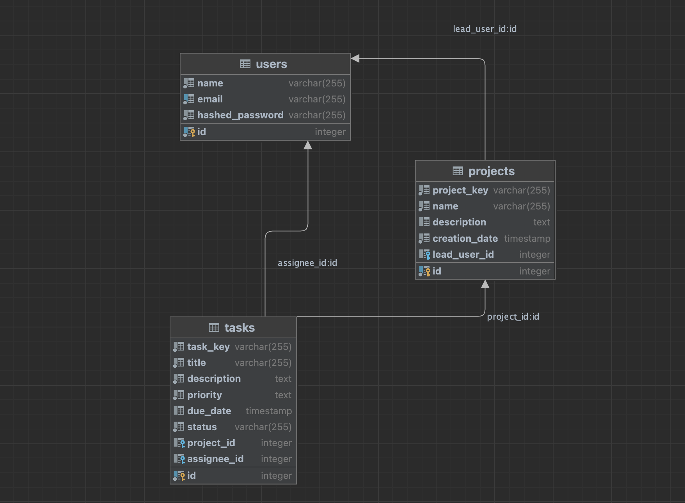

# Issue-Tracker

Проектът за управление на задачи е уеб приложение, което помага на екипите да управляват своите проекти и да следят статуса на задачите им. Системата позволява на потребителите да организират и следят напредъка на задачите в проекта, да назначават задачи на членовете на екипа и да следят статуса на задачите.
## Аргитектура и дизайн на проекта
### Архитектурен шаблон и разпределение
Проектът е изграден, използвайки MVC(Model-View-Controller) архитектурния шаблон, който представлява разделяне на приложението в три основни компонента:
  - `model` - класове и функционалност, които използваме при работа с базата
  - `controller` - класове, които съдържат основната бизнес логика и служат за връзка между класове, свързани с "Потребителския интерфейс" и тези свързани с базата.
  - `view` -  класове и функционалност, съдържащи цялата логика за "Потребителския интерфейс".
  
Разделението на проекта на смислови части е следното:
  - клиентска част: където влизат всички основни и помощни класове, свързани с изграждането на 'Потребителския интерфейс'
  - сървърна част: влизат всички основни и помощни класове, свързани с работата на сървъра и тези нужни за работа с базата.

### Дизайн
Проекта съдържа няколко различни изгледа за работа с него, като всеки един от тях е логически свързан с останалите. Основните визуални интерфейси, който за момента за имплементирани са: 
   - `табло за билетите:` - поддържащо всички възможни функционалностти, свързани с билетите

   - `табло за проектите:` - поддържащо основни операции свързани с проектите
   
   - `форма за регистрация:` - визуализира отделните полета за попълване на информация при направата на регистрация
   
   - `форма за вписване:` - визуализира полета за вписване

### Класове, свързани с базата

#### Потребители

Потребител (User) представлява потребител в системата. Той има следните атрибути:

- `name`: името на потребителя
- `email`: имейл адресът на потребителя
- `hashed_password`: криптираната парола на потребителя

#### Проекти

 Проект (Project) представлява проект в системата. Той има следните атрибути:
- `id`: индентификатор на проекта
- `name`: името на проекта
- `description`: описание на проекта
- `creation_date`: дата на създаване на проекта
- `lead_user_id`: идентификатор на потребителя, който е лидер на проекта

#### Задачи

 Задача (Task) представлява задача в системата. Той има следните атрибути:
- `id`: индентификатор на задачата
- `title`: заглавие на задачата
- `description`: описание на задачата
- `priority`: приоритет на задачата
- `due_date`: дата на изпълнение на задачата
- `status`: статус на задачата (напр. "изчакваща", "в процес на изпълнение", "завършена" и т.н.)
- `project_id`: идентификатор на проекта, където е свързана задачата
- `assignee_id`: идентификатор на потребителя, на когото е назначена задачата

#### Диаграма на класовете



# Работа с проекта
## Tech stack
  - `Node.js`
  - `Express.js`
  - `PostgreSQL`
  - `Docker`

## Изисквания

За да стартирате това приложение, ви е необходимо:

- Node.js инсталиран на вашия компютър. Можете да изтеглите и инсталирате Node.js от [официалния уебсайт](https://nodejs.org).
- Docker инсталиран на вашия компютър. Можете да изтеглите и инсталирате Docker от [официалния уебсайт](https://www.docker.com).

## Инсталация

1. Клонирайте хранилището на локалния ви компютър:

   ```shell
   git clone https://github.com/VeronikaIR/Issue-Tracker
   ```

2. Отидете в директорията на проекта:

   ```shell
   cd Issue-Tracker
   ```

3. Инсталирайте зависимостите на проекта:

   ```shell
   npm install
   ```

## Настройка на базата данни

Това приложение използва PostgreSQL като база данни. За да стартирате PostgreSQL като Docker контейнер, използвайте следната команда:

```shell
docker run --name postgres -d -p 5432:5432 -e POSTGRES_PASSWORD=postgres -e POSTGRES_USER=postgres postgres
```

Това ще създаде Docker контейнер с името `postgres`, работещ на порт `5432`, като използва потребителско име `postgres` и парола `postgres`.

Конфигурацията на базата данни се намира във файлът `database.js`. Можете да модифицирате този файл, за да посочите вашите собствени настройки за базата данни.

## Стартиране на приложението

За да стартирате приложението, отидете в следната директорията на проекта: "/src/server" през терминала и стартирайте командата:

```shell
npm start
```

По този начин ще стартирате сървъра на приложението и ще можете да започнете работа с него. 

